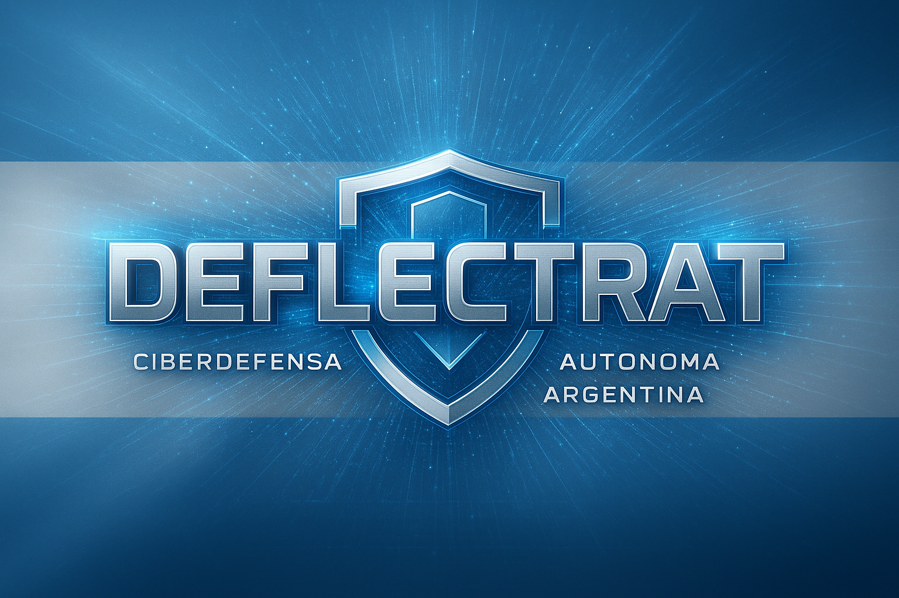

# DeflectRAT - Sitio Web Oficial (Vercel)



## 🛡️ Ciberarma Defensiva Autónoma Argentina

DeflectRAT es una ciberarma defensiva desarrollada en Argentina para la protección de infraestructuras críticas. Este repositorio contiene el sitio web oficial optimizado para despliegue en **Vercel**.

## 🌐 Demo en Vivo

**URL del Sitio Web**: [Desplegado en Vercel]

[](https://vercel.com/new/clone?repository-url=https://github.com/[tu-usuario]/deflectrat-vercel)

## ✨ Características del Sitio Web

### 🎨 Diseño Profesional
- Interfaz moderna con gradientes azules y efectos visuales
- Navegación fija con scroll suave entre secciones
- Totalmente responsive (desktop y móvil)
- Animaciones y transiciones fluidas

### 📱 Secciones Principales

1. **🏠 Inicio**: Presentación principal con logo y descripción
2. **🎬 Video Promocional**: Presentación de 8 minutos con audio sincronizado
3. **🏗️ Arquitectura**: 6 módulos integrados del sistema
4. **🔬 Laboratorio**: Entorno de validación con 3 máquinas virtuales
5. **📊 Resultados**: Métricas superiores y escenarios validados
6. **🇦🇷 Soberanía**: Tecnología nacional argentina

### 🛠️ Tecnologías Utilizadas

- **React 19**: Framework principal
- **Tailwind CSS 4**: Estilos y diseño responsive
- **shadcn/ui**: Componentes UI profesionales
- **Lucide Icons**: Iconografía moderna
- **Vite 6**: Build tool optimizado
- **Vercel**: Hosting y despliegue

## 🚀 Despliegue en Vercel

### Método 1: Despliegue Automático (Recomendado)

1. **Fork o clona este repositorio**
2. **Ve a [vercel.com](https://vercel.com)**
3. **Clic en "New Project"**
4. **Importa tu repositorio de GitHub**
5. **Vercel detectará automáticamente la configuración**
6. **Clic en "Deploy"**

¡Tu sitio estará disponible en menos de 2 minutos!

### Método 2: Vercel CLI

```bash
# Instalar Vercel CLI
npm i -g vercel

# En el directorio del proyecto
vercel

# Seguir las instrucciones
```

### Método 3: Deploy Button

Usa el botón "Deploy with Vercel" arriba para despliegue con un clic.

## 🔧 Desarrollo Local

### Prerrequisitos
- Node.js 18+ 
- npm, pnpm o yarn

### Instalación
```bash
# Clonar el repositorio
git clone https://github.com/[tu-usuario]/deflectrat-vercel.git
cd deflectrat-vercel

# Instalar dependencias
npm install --legacy-peer-deps
# o
pnpm install
```

### Comandos de Desarrollo
```bash
# Servidor de desarrollo
npm run dev
# El sitio estará en http://localhost:3000

# Build para producción
npm run build

# Preview del build
npm run preview

# Linting
npm run lint
```

## 📁 Estructura del Proyecto

```
deflectrat-vercel/
├── public/                 # Archivos públicos estáticos
├── src/
│   ├── assets/            # Imágenes y recursos multimedia
│   ├── components/
│   │   └── ui/           # Componentes UI de shadcn/ui
│   ├── hooks/            # Custom React hooks
│   ├── lib/              # Utilidades y librerías
│   ├── App.jsx           # Componente principal
│   ├── App.css           # Estilos principales
│   ├── index.css         # Estilos globales
│   └── main.jsx          # Punto de entrada
├── dist/                  # Build de producción (generado)
├── vercel.json           # Configuración de Vercel
├── vite.config.js        # Configuración de Vite
├── package.json          # Dependencias y scripts
└── README.md             # Este archivo
```

## ⚙️ Configuración de Vercel

### Configuración Automática
Vercel detecta automáticamente:
- **Framework**: Vite
- **Build Command**: `npm run build`
- **Output Directory**: `dist`
- **Install Command**: `npm install --legacy-peer-deps`

### Configuración Manual (si es necesaria)
```json
{
  "buildCommand": "npm run build",
  "outputDirectory": "dist",
  "devCommand": "npm run dev",
  "installCommand": "npm install --legacy-peer-deps"
}
```

## 🎯 Arquitectura de DeflectRAT

El sitio web presenta los **6 módulos integrados** de DeflectRAT:

### 🔵 NMM - Network Monitoring Module
Monitoreo de redes y protocolos industriales como Modbus, DNP3 y OPC UA

### 🟠 PAM - Process Analysis Module  
Análisis de procesos del sistema con técnicas del marco MITRE ATT&CK

### 🟢 TIM - Threat Intelligence Module
Integración de inteligencia de amenazas de múltiples fuentes

### 🟣 ARM - Automated Response Module
Respuesta automática con hasta 15 acciones defensivas

### 🔵 FAM - Forensic Analysis Module
Análisis forense y conservación de evidencias digitales

### 🔵 CMM - Centralized Management Module
Gestión centralizada e integración mediante ELK Stack

## 📊 Resultados Superiores

DeflectRAT supera a las soluciones comerciales:

- **78%** más rápido en detección de amenazas
- **96.8%** de detección en entornos SCADA  
- **74%** menos costos operativos
- **23 segundos** de respuesta para mitigación njRAT

## 🔬 Laboratorio de Validación

Entorno controlado con **3 máquinas virtuales**:

1. **Windows 10 SCADA**: Sistema objetivo con servicios SCADA simulados
2. **Ubuntu Server**: DeflectRAT y stack ELK
3. **Kali Linux**: Atacante ejecutando escenarios maliciosos

## 🇦🇷 Soberanía Tecnológica Nacional

DeflectRAT representa un avance estratégico para Argentina:

- ✅ **Independencia Operativa**: Control completo de algoritmos
- ✅ **Soberanía de Datos**: Sin dependencias externas  
- ✅ **Personalización Local**: Adaptación a amenazas específicas
- ✅ **Economía Nacional**: Reducción de salida de divisas

## 🌐 Ventajas de Vercel

### ⚡ Rendimiento
- **Edge Network Global**: CDN en 100+ ubicaciones
- **Carga Ultra Rápida**: < 1 segundo de TTFB
- **Optimización Automática**: Imágenes, CSS, JS

### 🔄 Despliegue
- **Despliegue Automático**: En cada push a GitHub
- **Preview Deployments**: Para cada PR
- **Rollback Instantáneo**: Un clic para versiones anteriores

### 📊 Analytics
- **Web Analytics**: Métricas de rendimiento
- **Real User Monitoring**: Experiencia real de usuarios
- **Core Web Vitals**: Optimización SEO

## 🔧 Optimizaciones Incluidas

### 🖼️ Imágenes
- Todas las imágenes optimizadas para web
- Formatos modernos (WebP cuando es posible)
- Lazy loading automático

### 📦 Bundle
- Code splitting automático
- Tree shaking para eliminar código no usado
- Compresión gzip/brotli

### 🎨 CSS
- Tailwind CSS optimizado
- Purge de clases no utilizadas
- Critical CSS inline

## 📹 Video Promocional

El sitio incluye información sobre el **video promocional de 8 minutos** que presenta:

- Introducción a las ciberarmas defensivas
- Contexto de amenazas en Argentina  
- Presentación técnica de DeflectRAT
- Validación en laboratorio controlado
- Resultados y métricas de rendimiento
- Impacto estratégico y soberanía tecnológica

*Nota: El archivo de video (108MB) no está incluido en el repositorio. Se puede integrar usando servicios como YouTube o Vimeo.*

## 🤝 Contribuciones

Este proyecto representa una iniciativa de soberanía tecnológica argentina. Las contribuciones son bienvenidas:

1. Fork el repositorio
2. Crea una rama para tu feature (`git checkout -b feature/nueva-funcionalidad`)
3. Commit tus cambios (`git commit -am 'Agrega nueva funcionalidad'`)
4. Push a la rama (`git push origin feature/nueva-funcionalidad`)
5. Abre un Pull Request

## 📄 Licencia

Este proyecto está bajo la Licencia MIT. Ver el archivo `LICENSE` para más detalles.

## 👨‍💻 Autor

**Ing. Ricardo Alcides Canaveri**  
Desarrollador de DeflectRAT - Ciberarma Defensiva Argentina

## 📞 Contacto

Para consultas sobre DeflectRAT o colaboraciones:

- 📧 Email: [contacto@deflectrat.ar]
- 🌐 Web: [www.deflectrat.ar]
- 🐙 GitHub: [github.com/deflectrat]

## 🏆 Reconocimientos

DeflectRAT es una demostración de que los países en desarrollo pueden crear soluciones defensivas autónomas que superan a las comerciales, mientras refuerzan su soberanía tecnológica.

**🇦🇷 Hecho con orgullo en Argentina**

---

*DeflectRAT - El Futuro de la Ciberdefensa Argentina*

[](https://vercel.com)

